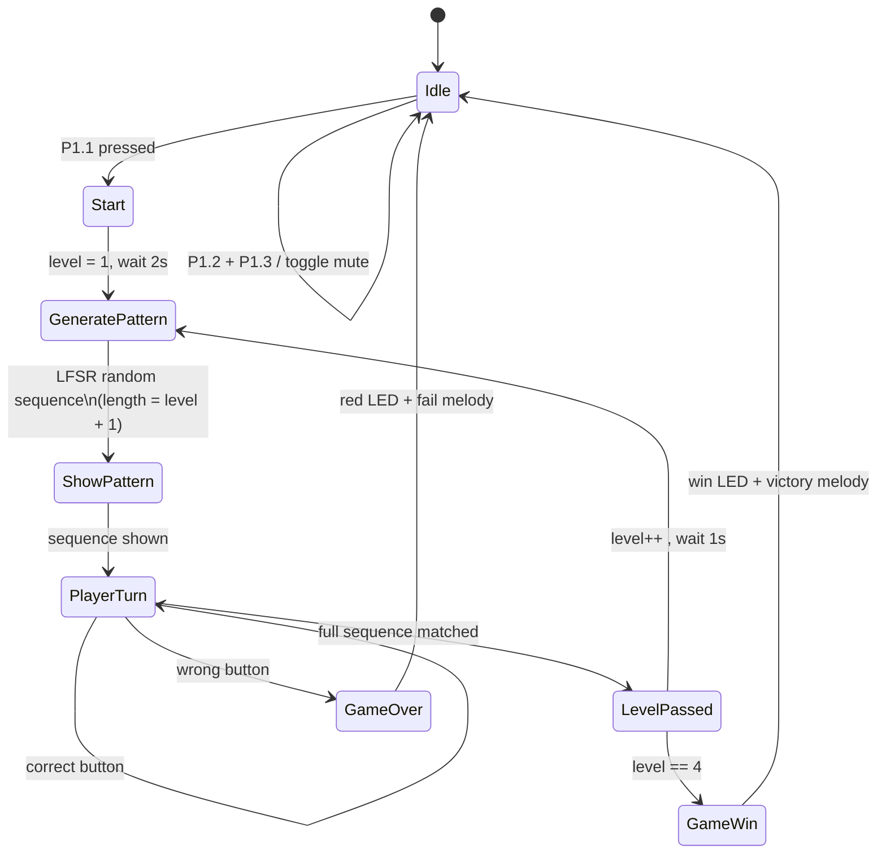

# Simon Says (MSP430)

A Simon Says memory game for the MSP430: four LEDs light in a random sequence, and the player repeats it with four buttons. Each level adds a step. Pass all levels for a win melody; miss a step and you get a fail melody.

Written in MSP430 assembly (`main.asm`) for TI Code Composer Studio.

## Hardware

| Pin | Role |
|---|---|
| P1.1–P1.4 | Game buttons (active-low, pull-up). P1.1 also starts the game |
| P2.0–P2.3 | Game LEDs |
| P2.4 | Win LED |
| P2.5 | Buzzer |
| P1.0 | Onboard red LED (fail) |
| P1.6 | Onboard green LED (level passed) |

Clock: calibrated 1 MHz DCO.

## Game flow

1. **Idle** — LEDs bounce `0 → 1 → 2 → 3 → 2 → 1 → 0` with a C–D–E–F idle tune. Press **P1.1** to start. In idle, **P1.2 + P1.3** together toggles mute.
2. **Show pattern** — A random sequence is generated (length = level + 1). Each step lights its LED and plays that LED’s tone.
3. **Player turn** — Repeat the sequence with the matching buttons. The pressed LED lights and its tone plays.
4. **Level passed** — Green LED flash + success beep. Next level.
5. **Fail** — Red LED on, all four game LEDs blink, fail tone, then back to idle.
6. **Win** — After level 4 (5 steps), the win LED (P2.4) turns on and a victory melody plays, then idle.

Levels: **1 → 2 steps**, **2 → 3**, **3 → 4**, **4 → 5** (max).

